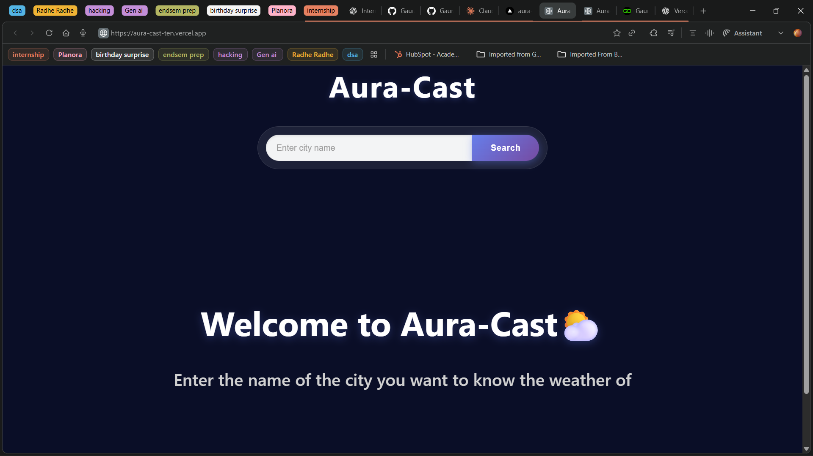
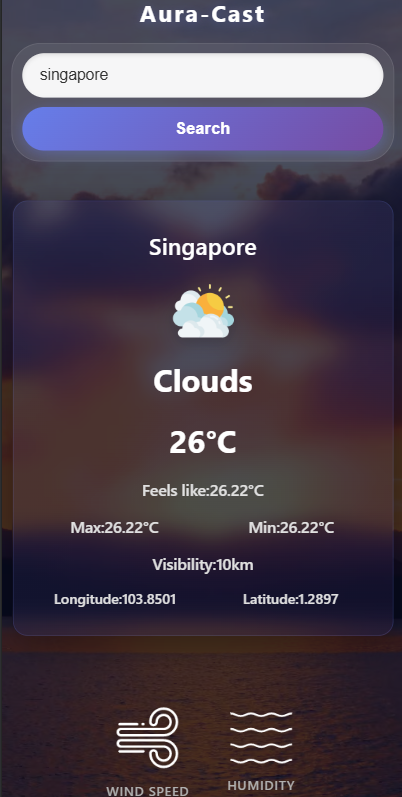

# Aura Cast 🌦️

Aura Cast is a modern weather application that provides real-time weather information for any searched location using live API data.  
It also enhances user experience with **dynamic video backgrounds** that change according to current weather conditions.

## 🚀 Live Demo
🔗 https://aura-cast-ten.vercel.app/

## 🛠 Tech Stack
- HTML
- CSS
- JavaScript
- OpenWeatherMap API

## 👤 My Role
This is a **personal frontend project**.
- Designed and developed the complete user interface
- Integrated real-time weather data using OpenWeatherMap API
- Implemented dynamic UI updates based on API responses
- Created weather-based animated video backgrounds

## ✨ Features
- Search weather details by location
- Displays real-time weather conditions including:
  - Temperature (current, feels like, max & min)
  - Visibility
  - Latitude & Longitude
  - Wind speed & wind direction
  - Humidity percentage
  - Cloudiness
  - Atmospheric pressure
  - Sea level pressure
  - Sunrise & sunset time
- Dynamic background videos based on weather conditions:
  - Sunny background for clear weather
  - Cloudy background for cloudy conditions
  - Weather-specific visual experience
- Clean and responsive UI

## 🌐 API Used
- **OpenWeatherMap API** for fetching real-time weather data

## 📸 Screenshots






## ⚙️ Installation & Setup
```bash
git clone https://github.com/Gaurav-dhall/Aura-Cast.git
cd Aura-Cast
open index.html
```

## 📚 Learnings

Working with third-party REST APIs

Handling asynchronous JavaScript (fetch, promises)

Parsing and displaying real-time data dynamically

Improving UI/UX using conditional rendering

Creating immersive experiences using video backgrounds

## 📌 Project Status

✅ Completed
✅ Deployed
